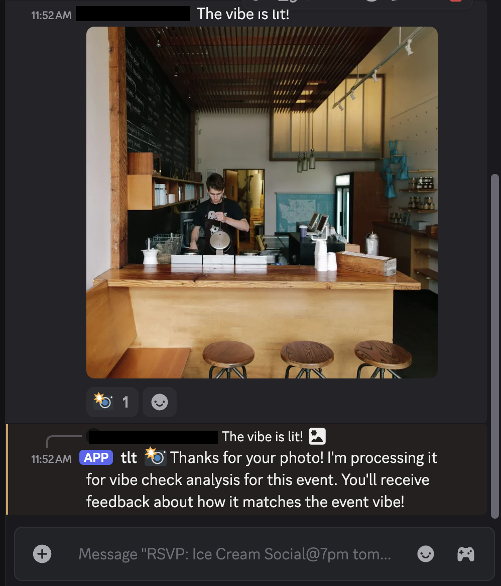
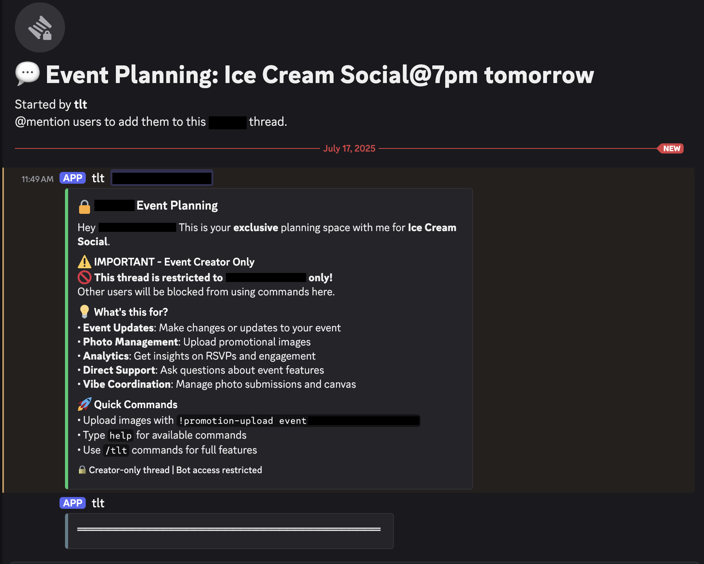
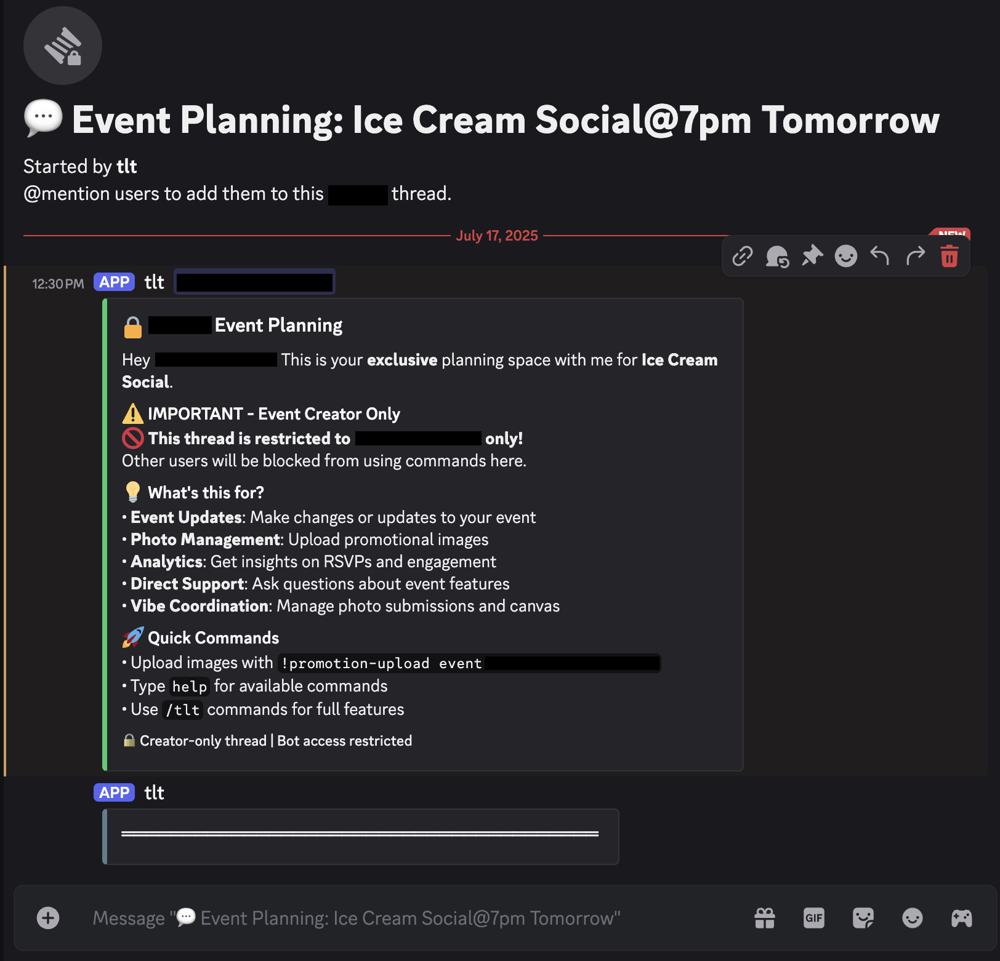

# TLT User Guide - Discord Event Management

Welcome to TLT (The Legendary Times)! This comprehensive guide will walk you through every feature of our Discord-based event management platform with AI-powered photo vibe checking and collaborative tools.

## Table of Contents

1. [Getting Started - Guild Registration](#getting-started---guild-registration)
2. [Creating Your First Event](#creating-your-first-event)
3. [Participating in Events (RSVP)](#participating-in-events-rsvp)
4. [Photo Vibe Check System](#photo-vibe-check-system)
5. [Event Owner Features](#event-owner-features)
6. [Event Analytics & Insights](#event-analytics--insights)
7. [Advanced Features](#advanced-features)

---

## Getting Started - Guild Registration

### Step 1: Register Your Discord Server

**Prerequisites**: You must be a Discord server administrator to register your guild.

**How to Register:**

1. **Run the Command**: Type `/register` in any channel where the TLT bot is present
2. **Admin Verification**: The bot automatically checks if you have administrator permissions
3. **Confirmation**: You'll see a green success message with:
   - 🎉 **Guild Registered!** confirmation
   - Your Discord username as the registering admin
   - **Next Steps**: Clear guidance to start creating events

**What Happens After Registration:**
- Your server is now enabled for TLT event management
- All guild members can create and participate in events
- AI features are activated for photo vibe checking
- Event analytics and insights become available

**Next Step**: Use `/tlt create` to create your first event!

---

## Creating Your First Event

### Step 1: Launch Event Creation

**How to Create an Event:**

1. **Run the Command**: Type `/tlt create` in any channel
2. **Interactive Modal**: A beautiful form appears with three required fields:

   **🎯 Topic/Title** *(Required)*
   - Enter your event name (e.g., "Ice Cream Social")
   - Keep it engaging and descriptive

   **📍 Location** *(Required)*
   - Add the venue or meeting place (e.g., "Molly Moon's")
   - Can be physical locations or virtual meeting links

   **⏰ Time** *(Required)*
   - Specify when the event happens (e.g., "7pm tomorrow")
   - Use natural language - the AI understands various formats

3. **Security Notice**: The form includes a warning about not sharing sensitive information
4. **Submit**: Click the blue "Submit" button to create your event

### Step 2: Event Infrastructure Creation

**What TLT Automatically Creates:**

✅ **Main Event Post**
- Beautiful embed with all event details
- Default reaction emojis for RSVP (✅, ❌, 🤔, 🔥, 💯, 👀)
- Professional appearance with calendar icons and formatting

✅ **Public RSVP Thread**
- Emoji-only discussion space for community energy
- Automatic moderation to maintain vibe
- Real-time RSVP tracking and updates

✅ **Private Planning Thread**
- Creator-only space for event management
- AI assistant for planning help
- Promotional image upload capabilities

✅ **Automatic Reminders**
- 24 hours before event
- 2 hours before event
- 30 minutes before event

✅ **AI Agent Monitoring**
- Continuous event lifecycle management
- Photo vibe checking activation
- Analytics and insights generation

---

## Participating in Events (RSVP)

### Step 1: React to Events

**How to RSVP:**

1. **Find the Event**: Look for event embeds in your Discord channels
2. **Choose Your Response**: Click on any emoji that matches your attendance:
   - ✅ **Yes** - I'm definitely attending
   - ❌ **No** - I can't make it
   - 🤔 **Maybe** - I'm unsure about my availability
   - 🔥 **Excited** - I'm super pumped for this!
   - 💯 **Absolutely** - Wild horses couldn't keep me away
   - 👀 **Interested** - I'm watching to see who else goes

3. **Real-time Updates**: Your RSVP is instantly processed and counted
4. **Change Anytime**: Click different emojis to update your response

### Step 2: Join the RSVP Thread

**The RSVP Thread Experience:**

📍 **Thread Details**
- Clearly labeled with event name and time
- Started automatically by the TLT bot
- Shows creation date and "NEW" indicator for recent events

🎭 **Vibe Check Zone**
- **Emoji-Only Energy**: The thread encourages emoji-only communication
- **Community Building**: Share excitement and anticipation
- **Moderated Space**: Bot maintains the energy and removes non-emoji messages

🎪 **Event Information Repost**
- Full event details are reposted in the thread
- Easy access to location, time, and creator information
- Direct link back to main event post

**Thread Features:**
- 🚀 **High Energy Environment**: Designed for excitement and anticipation
- 🤖 **AI Moderation**: Automatic emoji-only enforcement
- 💫 **Community Vibes**: Shared space for event enthusiasm

### Step 3: Extended RSVP Engagement

**Advanced Thread Features:**

🌟 **Continuous Engagement**
- Thread remains active until event completion
- Multiple ways to express excitement and interest
- Community members can see who else is engaged

📊 **Real-time Updates**
- Live RSVP counting and display
- Emoji reaction summaries
- Community energy visualization

🎉 **Pre-Event Excitement**
- Build anticipation leading up to the event
- Share energy with fellow attendees
- Create connections before meeting in person

---

## Photo Vibe Check System

### Step 1: Submit Photos via DM

**How to Submit Photos for Vibe Checking:**

1. **Direct Message the Bot**: Send a private DM to the TLT bot
2. **Attach Your Photo**: Upload any image that captures the event vibe
3. **Add Context**: Include a message like "The vibe is lit!" or "Check out this scene!"
4. **AI Processing Begins**: The bot immediately starts analyzing your photo

**What the AI Analyzes:**
- 🖼️ **Content Recognition**: Scene, activities, people, atmosphere
- 🎭 **Vibe Matching**: Comparison against event promotional images
- 🎯 **Relevance Scoring**: How well it matches the expected event energy
- 🏆 **Quality Assessment**: Technical and aesthetic evaluation

### Step 2: Receive AI Feedback

**AI Response Features:**

📱 **Instant Processing**
- Bot confirms receipt: "Thanks for your photo! I'm processing it for vibe check analysis"
- Mentions the specific event (e.g., "Ice Cream Social@7pm tomorrow")
- Promise of feedback about event vibe matching

🤖 **AI Analysis Pipeline**
- Multi-stage LangGraph workflow processing
- GPT-4o Vision for advanced image understanding
- Comparison against promotional reference images
- Weighted scoring for vibe compatibility

🎊 **Personalized Feedback**
- Gen-Z style responses and encouragement
- Specific insights about how your photo matches the event
- Suggestions for optimal vibe alignment
- Inclusion status for potential event slideshows

**Technical Features:**
- **Rate Limiting**: Prevents spam while encouraging participation
- **RSVP Validation**: Must be confirmed attendee to submit
- **Format Support**: JPEG, PNG, WebP, AVIF image formats
- **Quality Control**: Automatic size and quality validation

---

## Event Owner Features

### Step 1: Access Private Planning Thread

**Private Planning Thread Features:**

🔒 **Creator-Only Access**
- **Exclusive Space**: Only you and the TLT bot have access
- **Planning Privacy**: Plan without public oversight
- **Bot Assistance**: AI helper for event organization

**Available Features:**

📝 **Event Management**
- **Event Updates**: Modify topic, location, time
- **Photo Management**: Upload promotional images
- **Analytics**: Deep insights on RSVPs and engagement
- **Direct Support**: Ask questions about event features

🎨 **Vibe Coordination**
- **Photo Submissions**: Manage incoming photo vibe checks
- **Canvas Features**: Coordinate collaborative visual elements
- **Community Energy**: Monitor and guide event excitement

### Step 2: Planning Thread Guidance

**Planning Thread Capabilities:**

⚠️ **Important Restrictions**
- Thread is restricted to event creator only
- Other users are blocked from using commands
- Maintains planning privacy and focus

💡 **What's Available:**
- **Event Updates**: Make changes or updates to your event
- **Photo Management**: Upload promotional images for vibe reference
- **Analytics**: Get insights on RSVPs and engagement levels
- **Direct Support**: Ask questions about event features
- **Vibe Coordination**: Manage photo submissions and canvas features

🚀 **Quick Commands**
- Upload images with `!promotion-upload event:ID`
- Type `help` for available commands
- Use `/tlt` commands for full features

🔐 **Security Features**
- Creator-only thread with bot access restricted
- Private planning environment
- No external interference or visibility

### Step 3: Event Planning Assistance

**AI Planning Assistant Features:**

🤖 **Intelligent Support**
- Step-by-step event organization guidance
- Answers to planning questions and concerns
- Suggestions for improving event engagement
- Real-time advice during planning process

📊 **Performance Optimization**
- RSVP tracking and analysis recommendations
- Community engagement improvement tips
- Photo vibe checking coordination advice
- Timeline and reminder optimization

🎯 **Success Metrics**
- Attendance prediction and analysis
- Community energy assessment
- Engagement quality measurement
- Long-term planning insights

### Step 4: Help and Guidance

**Comprehensive Help System:**

📚 **Available Resources**
- Complete command reference and documentation
- Step-by-step workflows for complex tasks
- Troubleshooting guides for common issues
- Best practices for successful events

🎪 **Event Optimization**
- Community engagement strategies
- Photo vibe checking coordination
- RSVP maximization techniques
- Timeline and reminder optimization

🔧 **Technical Support**
- Command syntax and usage examples
- Integration with other Discord features
- Advanced analytics interpretation
- Customization options and settings

### Step 5: Promotional Media Management

**Promotional Image Features:**

📸 **Image Upload Process**
- Upload multiple promotional images in private thread
- Images define the expected event vibe and atmosphere
- Bot processes and stores images for AI reference
- Automatic organization by guild and event

🎭 **Vibe Reference Standards**
- Images become the benchmark for photo vibe checking
- AI uses these to evaluate submitted photos
- Community sees visual identity of the event
- Helps set clear expectations for attendees

**Advanced Image Management:**

🌟 **Multiple Image Support**
- Upload several images to capture different aspects
- Create comprehensive vibe profile for your event
- Show various angles, moods, and energy levels
- Build rich visual context for AI analysis

📊 **Cross-Platform Sharing**
- Images automatically cross-posted to public RSVP thread
- Community transparency and excitement building
- Visual preview of expected event atmosphere
- Enhanced community engagement and anticipation

### Step 6: Image Cross-Posting

**Automatic Cross-Posting Features:**

🔄 **Seamless Sharing**
- Images uploaded in private thread automatically appear in public RSVP thread
- Maintains event transparency and community engagement
- Shows visual identity without requiring manual reposting
- Keeps promotional content synchronized across all spaces

**Community Benefits:**

👥 **Enhanced Engagement**
- Community members see visual expectations
- Builds excitement and anticipation
- Helps attendees prepare appropriately
- Creates shared understanding of event vibe

🎨 **Visual Identity**
- Establishes clear event aesthetic and atmosphere
- Provides reference for photo submissions
- Creates cohesive event experience
- Improves overall community participation

---

## Event Analytics & Insights

### Comprehensive Event Analytics

**Analytics Dashboard Features:**

📊 **Event Details Section**
- **Event Name**: Clear identification (e.g., "Ice Cream Social")
- **Location**: Full venue details ("Molly Moon's")
- **Timing**: Specific time information ("7pm Tomorrow")
- **Creation Date**: When the event was created (2025-07-17)
- **Message ID**: Unique Discord message identifier for technical reference

👥 **RSVP Summary**
- **Total Responses**: Complete count of all RSVPs (e.g., "1")
- **Emoji Breakdown**: Detailed breakdown by reaction type
- **Real-time Updates**: Live tracking as responses change
- **Response Patterns**: Trends and engagement insights

🔗 **Thread Links**
- **Public RSVP Thread**: Direct access to community discussion
- **Private Planning**: Quick access to creator-only space
- **Main Event Post**: Jump to original event message
- **Easy Navigation**: One-click access to all event components

💡 **Advanced Features Access**
- **Command Reference**: "/tlt commands for more advanced features"
- **Deep Analytics**: Additional insights and measurements
- **Performance Tracking**: Long-term event success metrics
- **Community Impact**: Guild-wide engagement analysis

### Status Information Display

**Real-Time Status Monitoring:**

⏱️ **Live Updates**
- Current RSVP counts and trends
- Recent activity and engagement levels
- Photo submission status and vibe scores
- Community energy and participation metrics

📈 **Performance Indicators**
- Attendance prediction algorithms
- Engagement quality measurements
- Community excitement levels
- Success probability assessments

🎯 **Optimization Suggestions**
- Recommendations for improving attendance
- Timing adjustments for maximum engagement
- Community outreach and promotion tips
- Content and vibe optimization advice

---

## Advanced Features

### Automated Event Reminders

**Smart Reminder System:**

⏰ **Automated Schedule**
- **24 Hours Before**: Initial reminder with full event details
- **2 Hours Before**: Final preparation reminder
- **30 Minutes Before**: Last-call reminder and excitement builder

🎯 **Personalized Messages**
- **RSVP-Aware**: Different messages based on user's RSVP status
- **Context-Rich**: Includes location, time, and relevant details
- **Community Building**: Encourages final engagement and excitement
- **Action-Oriented**: Clear next steps and preparation guidance

🤖 **AI Intelligence**
- Smart timing based on event type and community patterns
- Customized content based on individual engagement history
- Dynamic adjustment based on RSVP response rates
- Integration with other event lifecycle features

**Reminder Features:**
- 📍 **Location Reminders**: Clear venue information and directions
- 👥 **Social Context**: Who else is attending and excited
- 🎉 **Energy Building**: Excitement and anticipation messaging
- ⚡ **Last-Minute Updates**: Any changes or important information

---

## Pro Tips for Success

### For Event Creators

🎯 **Maximize Attendance**
- Upload compelling promotional images to set clear vibe expectations
- Use the private planning thread to coordinate with the AI assistant
- Monitor analytics regularly and adjust based on engagement patterns
- Engage with photo submissions to build community excitement

🎨 **Optimize Vibe Checking**
- Upload multiple promotional images showing different aspects
- Encourage photo submissions through personal outreach
- Use the cross-posting feature to build visual anticipation
- Coordinate with community members for optimal photo timing

📊 **Leverage Analytics**
- Check RSVP trends regularly to predict attendance
- Use thread links for quick navigation between spaces
- Monitor emoji patterns to understand community preferences
- Plan follow-up events based on success metrics

### For Community Members

🎉 **Maximize Engagement**
- React with emojis that truly reflect your excitement level
- Submit photos that capture the real event atmosphere
- Participate in emoji-only RSVP threads for community building
- Help build excitement for others through active participation

📸 **Photo Vibe Success**
- Study promotional images to understand expected vibe
- Submit photos that match the energy and atmosphere
- Use good lighting and composition for better AI analysis
- Include context in your DM messages for better processing

👥 **Community Building**
- Use diverse emoji reactions to express nuanced responses
- Engage consistently across multiple events
- Help newcomers understand the emoji-only thread culture
- Build relationships through shared event experiences

---

## Troubleshooting

### Common Issues

❌ **"Guild not registered" Error**
- **Solution**: Ask a server administrator to run `/register`
- **Prevention**: Ensure your Discord server has been set up for TLT

❌ **Cannot create events**
- **Check**: Verify the guild is registered with TLT
- **Permissions**: Ensure you have message sending permissions
- **Bot Status**: Confirm TLT bot is online and responsive

❌ **Photo not processing**
- **Format**: Ensure image is JPEG, PNG, WebP, or AVIF
- **Size**: Check file size isn't too large
- **RSVP**: Verify you've RSVP'd to the event first
- **Rate Limiting**: Wait if you've submitted multiple photos recently

❌ **Threads not appearing**
- **Permissions**: Check thread creation permissions in the channel
- **Bot Permissions**: Ensure TLT bot can create threads
- **Channel Settings**: Verify threads are enabled in the channel

### Getting Help

🆘 **Support Channels**
- Use `/tlt help` for command reference
- Type `help` in private planning threads
- Check event analytics for troubleshooting insights
- Contact server administrators for permission issues

📚 **Documentation**
- Review this User Guide for detailed walkthroughs
- Check USECASES.md for specific scenario guidance
- Reference ARCHITECTURE.md for technical understanding
- Use command syntax help for specific feature questions

---

## Conclusion

TLT transforms your Discord server into a powerful event management platform with AI-powered features, intelligent automation, and rich community engagement tools. By following this guide, you'll be able to create memorable events, build stronger communities, and leverage cutting-edge AI technology for enhanced social experiences.

Start with `/register` to get your server set up, then dive into creating your first event with `/tlt create`. The AI will handle the rest, creating a comprehensive event ecosystem that brings your community together!

**Happy event planning! 🎉**