# TLT Architecture Documentation

## Overview

TLT is a microservices-based event management platform that combines Discord bot integration with AI-powered photo vibe checking and collaborative features. The system is built using LangGraph for agent orchestration, FastMCP for service communication, and modern Python/TypeScript technologies.

## System Architecture

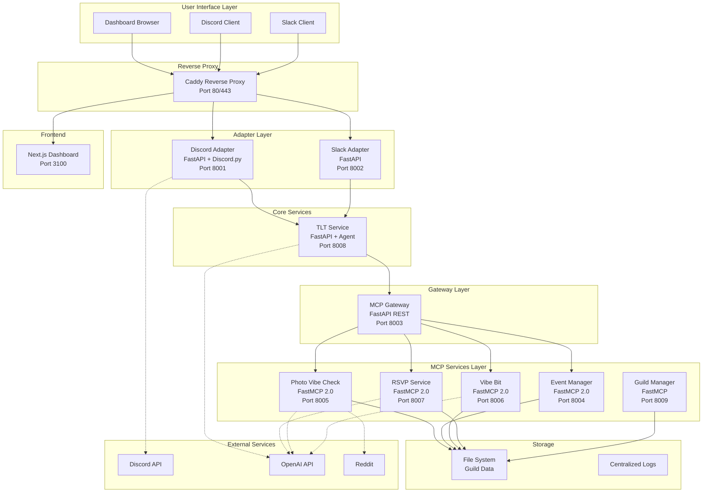

## LangGraph Agents

### 1. Ambient Event Agent

The core orchestration agent that manages all event lifecycle operations using LangGraph workflows.

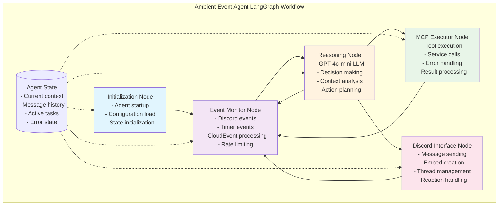

#### Agent State Management

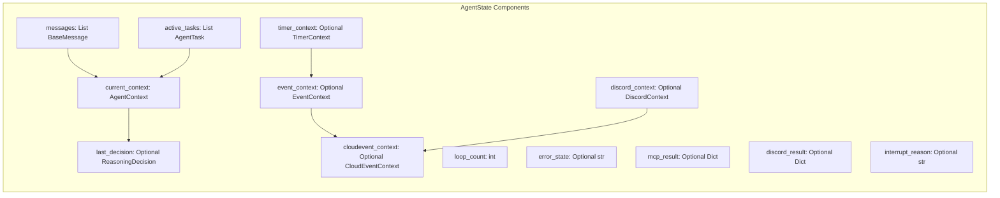

### 2. Photo Vibe Check Workflow

AI-powered photo analysis agent using LangGraph for multi-stage photo processing.

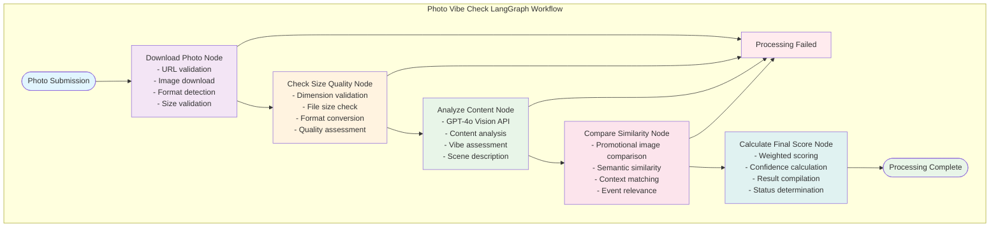

#### Photo Processing State

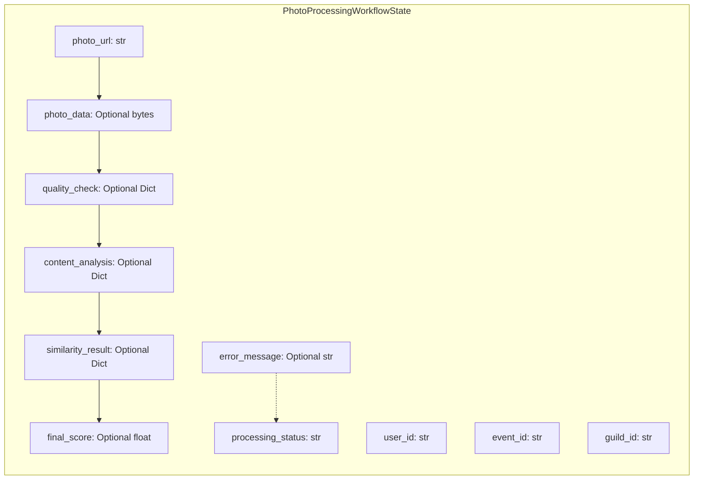

## Discord Command Flows

### `/register` Command Flow

```mermaid
flowchart TD
    START([User: /register])
    
    CHECK_ADMIN{Is user admin?}
    ADMIN_ERROR[❌ Error: Admin only]
    
    CHECK_REGISTERED{"Guild already
    registered?"}
    ALREADY_REG["❌ Already registered"]
    
    STORE_GUILD["📝 Store guild in
    local storage"]
    
    CREATE_CLOUDEVENT["☁️ Create CloudEvent
    guild.register"]
    
    SEND_TO_TLT["📤 Send to TLT Service"]
    
    CREATE_EMBED["🎨 Create registration
    embed response"]
    
    SUCCESS[✅ Registration complete]
    
    START --> CHECK_ADMIN
    CHECK_ADMIN -->|No| ADMIN_ERROR
    CHECK_ADMIN -->|Yes| CHECK_REGISTERED
    CHECK_REGISTERED -->|Yes| ALREADY_REG
    CHECK_REGISTERED -->|No| STORE_GUILD
    STORE_GUILD --> CREATE_CLOUDEVENT
    CREATE_CLOUDEVENT --> SEND_TO_TLT
    SEND_TO_TLT --> CREATE_EMBED
    CREATE_EMBED --> SUCCESS
    
    style START fill:#e1f5fe
    style SUCCESS fill:#e8f5e8
    style ADMIN_ERROR fill:#ffebee
    style ALREADY_REG fill:#fff3e0
```

### `/deregister` Command Flow

```mermaid
flowchart TD
    START([User: /deregister])
    
    CHECK_ADMIN{Is user admin?}
    ADMIN_ERROR[❌ Error: Admin only]
    
    CHECK_REGISTERED{Guild registered?}
    NOT_REG[❌ Not registered]
    
    GET_EVENTS[📊 Get active events count]
    GET_REMINDERS[⏰ Get active reminders count]
    
    REMOVE_GUILD["🗑️ Remove guild from
    local storage"]
    
    CREATE_CLOUDEVENT["☁️ Create CloudEvent
    guild.deregister"]
    
    SEND_TO_TLT["📤 Send to TLT Service"]
    
    CREATE_EMBED["🎨 Create deregistration
    embed with impact metrics"]
    
    SUCCESS[✅ Deregistration complete]
    
    START --> CHECK_ADMIN
    CHECK_ADMIN -->|No| ADMIN_ERROR
    CHECK_ADMIN -->|Yes| CHECK_REGISTERED
    CHECK_REGISTERED -->|No| NOT_REG
    CHECK_REGISTERED -->|Yes| GET_EVENTS
    GET_EVENTS --> GET_REMINDERS
    GET_REMINDERS --> REMOVE_GUILD
    REMOVE_GUILD --> CREATE_CLOUDEVENT
    CREATE_CLOUDEVENT --> SEND_TO_TLT
    SEND_TO_TLT --> CREATE_EMBED
    CREATE_EMBED --> SUCCESS
    
    style START fill:#e1f5fe
    style SUCCESS fill:#e8f5e8
    style ADMIN_ERROR fill:#ffebee
    style NOT_REG fill:#fff3e0
```

### `/tlt create` Command Flow

```mermaid
flowchart TD
    START(["User: /tlt create"])
    
    CHECK_REG{"Guild registered?"}
    NOT_REG["❌ Guild not registered"]
    
    SHOW_MODAL["📝 Show Event Create Modal
    - Topic
    - Location
    - Time"]
    
    VALIDATE_INPUT{"Input valid?"}
    INPUT_ERROR["❌ Validation error"]
    
    CREATE_EVENT["🎯 Create event in
    local storage"]
    
    CREATE_EMBED["🎨 Create event embed
    with details"]
    
    POST_MESSAGE["📤 Post event message"]
    
    ADD_REACTIONS["😀 Add default reactions
    ✅ ❌ 🤔 🔥 💯 👀"]
    
    CREATE_PUBLIC_THREAD["🧵 Create public RSVP thread
    (emoji-only rules)"]
    
    CREATE_PRIVATE_THREAD["🔒 Create private planning thread
    (creator only)"]
    
    SCHEDULE_REMINDERS["⏰ Schedule automatic reminders
    24h, 2h, 30min before"]
    
    CREATE_CLOUDEVENT["☁️ Create CloudEvent
    event.created"]
    
    SEND_TO_TLT["📤 Send to TLT Service"]
    
    SUCCESS["✅ Event created successfully"]
    
    START --> CHECK_REG
    CHECK_REG -->|No| NOT_REG
    CHECK_REG -->|Yes| SHOW_MODAL
    SHOW_MODAL --> VALIDATE_INPUT
    VALIDATE_INPUT -->|No| INPUT_ERROR
    VALIDATE_INPUT -->|Yes| CREATE_EVENT
    CREATE_EVENT --> CREATE_EMBED
    CREATE_EMBED --> POST_MESSAGE
    POST_MESSAGE --> ADD_REACTIONS
    ADD_REACTIONS --> CREATE_PUBLIC_THREAD
    CREATE_PUBLIC_THREAD --> CREATE_PRIVATE_THREAD
    CREATE_PRIVATE_THREAD --> SCHEDULE_REMINDERS
    SCHEDULE_REMINDERS --> CREATE_CLOUDEVENT
    CREATE_CLOUDEVENT --> SEND_TO_TLT
    SEND_TO_TLT --> SUCCESS
    
    style START fill:#e1f5fe
    style SUCCESS fill:#e8f5e8
    style NOT_REG fill:#ffebee
    style INPUT_ERROR fill:#ffebee
```

### `/tlt vibe` Command Flow

```mermaid
flowchart TD
    START([User: /tlt vibe])
    
    CHECK_REG{Guild registered?}
    NOT_REG[❌ Guild not registered]
    
    GET_EVENTS[📊 Get guild events]
    
    CHECK_EVENTS{Events exist?}
    NO_EVENTS[❌ No events found]
    
    SHOW_EVENT_SELECT["📝 Show event selection
    dropdown"]
    
    SELECT_EVENT["🎯 User selects event"]
    
    SHOW_ACTION_SELECT["🎨 Show vibe action selection
    📸 Generate Slideshow
    📊 Create Snapshot
    🎨 Canvas Preview
    📷 Photo Summary"]
    
    SELECT_ACTION["⚡ User selects action"]
    
    CREATE_CLOUDEVENT["☁️ Create CloudEvent
    vibe.action.requested"]
    
    SEND_TO_TLT["📤 Send to TLT Service"]
    
    AI_PROCESSING["🤖 AI Agent processes
    vibe request"]
    
    GENERATE_RESULT["🎭 Generate AI content
    - Slideshow
    - Vibe analysis
    - Canvas render
    - Photo summary"]
    
    SEND_RESPONSE[📤 Send result to Discord]
    
    SUCCESS[✅ Vibe action complete]
    
    START --> CHECK_REG
    CHECK_REG -->|No| NOT_REG
    CHECK_REG -->|Yes| GET_EVENTS
    GET_EVENTS --> CHECK_EVENTS
    CHECK_EVENTS -->|No| NO_EVENTS
    CHECK_EVENTS -->|Yes| SHOW_EVENT_SELECT
    SHOW_EVENT_SELECT --> SELECT_EVENT
    SELECT_EVENT --> SHOW_ACTION_SELECT
    SHOW_ACTION_SELECT --> SELECT_ACTION
    SELECT_ACTION --> CREATE_CLOUDEVENT
    CREATE_CLOUDEVENT --> SEND_TO_TLT
    SEND_TO_TLT --> AI_PROCESSING
    AI_PROCESSING --> GENERATE_RESULT
    GENERATE_RESULT --> SEND_RESPONSE
    SEND_RESPONSE --> SUCCESS
    
    style START fill:#e1f5fe
    style SUCCESS fill:#e8f5e8
    style NOT_REG fill:#ffebee
    style NO_EVENTS fill:#fff3e0
    style AI_PROCESSING fill:#f3e5f5
```

## Service Communication Architecture

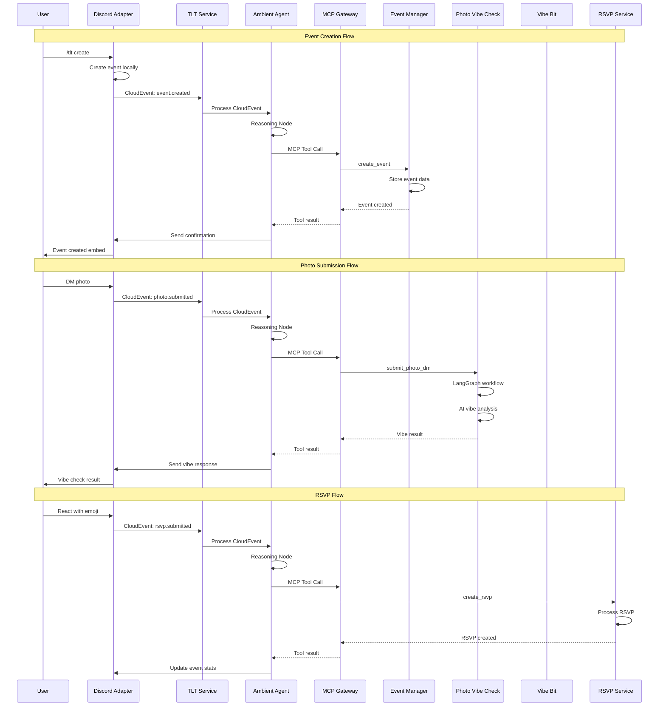

## Data Flow Architecture

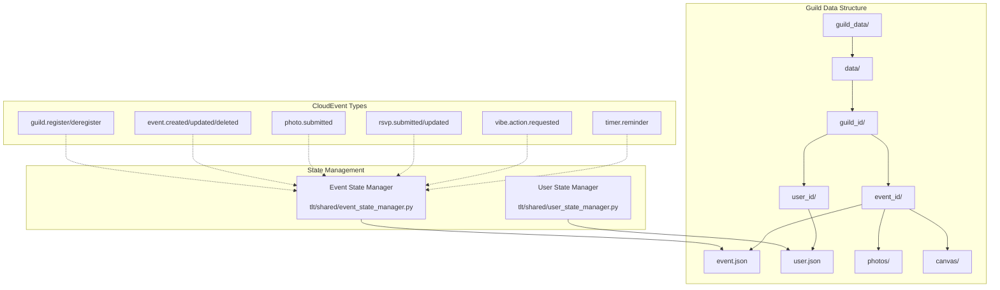

## Technology Stack

### Backend Services
- **LangGraph**: Agent orchestration and workflow management
- **FastMCP 2.0**: Model Context Protocol for service communication
- **FastAPI**: REST API framework for adapters and services
- **Discord.py**: Discord bot integration
- **OpenAI GPT-4o**: AI reasoning and photo analysis
- **Pydantic**: Data validation and serialization
- **Loguru**: Structured logging

### Frontend
- **Next.js 15**: Web dashboard framework
- **React 19**: User interface library
- **Tailwind CSS 4**: Styling framework
- **TypeScript**: Type-safe JavaScript

### Infrastructure
- **Docker**: Containerization
- **Caddy**: Reverse proxy and HTTPS termination
- **Supervisord**: Process management
- **Poetry**: Python dependency management
- **Alpine Linux**: Base container OS

### External Integrations
- **Discord API**: Real-time messaging and interactions
- **OpenAI API**: GPT-4o Vision for image analysis
- **CloudEvents**: Standardized event format for service communication

## Security & Reliability

### Authentication & Authorization
- Discord OAuth integration
- Role-based access control (RBAC) via Casbin
- Guild-level permissions
- Admin-only commands

### Rate Limiting
- 30 requests per minute per agent
- Discord API rate limiting compliance
- Photo upload size restrictions
- User action throttling

### Error Handling
- Comprehensive error recovery in LangGraph workflows
- Graceful degradation for service failures
- Retry logic with exponential backoff
- Detailed error logging and monitoring

### Data Persistence
- File system-based state management
- Automatic backup and recovery
- Structured JSON data storage
- Image and media file organization

This architecture provides a scalable, maintainable, and robust platform for Discord-based event management with AI-powered features, built on modern microservices principles and agent-based orchestration.