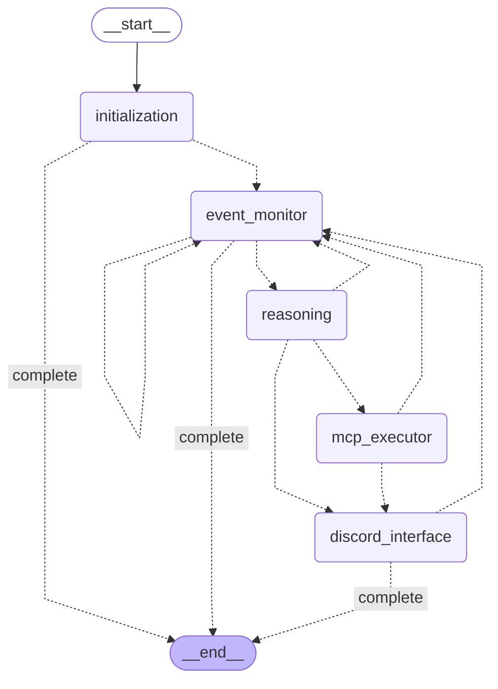

# Design

```mermaid
---
config:
  flowchart:
    curve: linear
---
graph TD;
        __start__([<p>__start__</p>]):::first
        initialization(initialization)
        event_monitor(event_monitor)
        reasoning(reasoning)
        mcp_executor(mcp_executor)
        discord_interface(discord_interface)
        __end__([<p>__end__</p>]):::last
        __start__ --> initialization;
        initialization -.-> event_monitor;
        initialization -. &nbsp;complete&nbsp; .-> __end__;
        event_monitor -.-> reasoning;
        event_monitor -. &nbsp;complete&nbsp; .-> __end__;
        reasoning -.-> mcp_executor;
        reasoning -.-> discord_interface;
        reasoning -.-> event_monitor;
        mcp_executor -.-> discord_interface;
        mcp_executor -.-> event_monitor;
        discord_interface -.-> event_monitor;
        discord_interface -. &nbsp;complete&nbsp; .-> __end__;
        event_monitor -.-> event_monitor;

        classDef default fill:#f2f0ff,line-height:1.2
        classDef first fill-opacity:0
        classDef last fill:#bfb6fc
```
